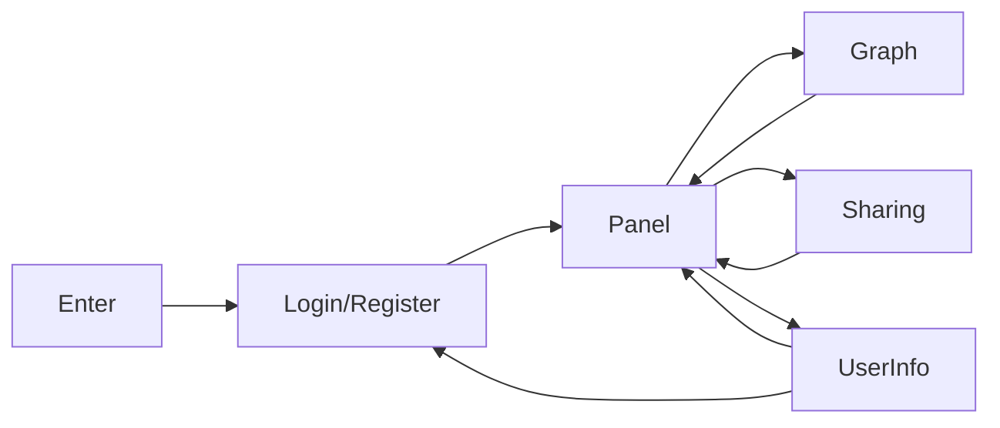

# Diagram Designer

<p align="right">Elec.Arts. 2021.04.06 Tue.</p>

A simple flow chart and UML diagram drawing program.

Email: Diagram-Designer@Outlook.com

ID:  wxe2a688a0a1be4c5f

## Frontend:

Platform: WXUI

### Pages:

#### Login / Register

Get user information via WX api.

#### User Information

Show user's information in details.

#### Panel

Show user's graph.

#### Graph

Show graph in details.

#### Sharing

Share graph control or view privilege with other users.

### Relationships:

UI Logic




## Backend:

Environment: GNU/Linux CentOS

Language: Go

Crypto Method: ECC


## Database:

MongoDB, a Key-Value NoSQL.

### Content Structure:

#### User Json

```Go
type User struct {
	ID		string	`json:id`
	Name	string	`json:na`
	Pwd		[]byte	`json:pd`
	Info	[]byte	`json:if`
}
```


#### Graph Json

```Go
type Graph struct {
    ID		string	`json:id`
    UserID	string	`json:ui`
    args	[]byte	`json:ar`
}
```


#### Sharing Map Json:

```Go
type SharingMap struct {
	UserID		string	`json:ui`
	GraphID		string	`json:gi`
	Privilege	string	`json:pi`
	Limit		string	`json:li`
}
```


<p align="center">Elec.Arts. NKU_2021</p>